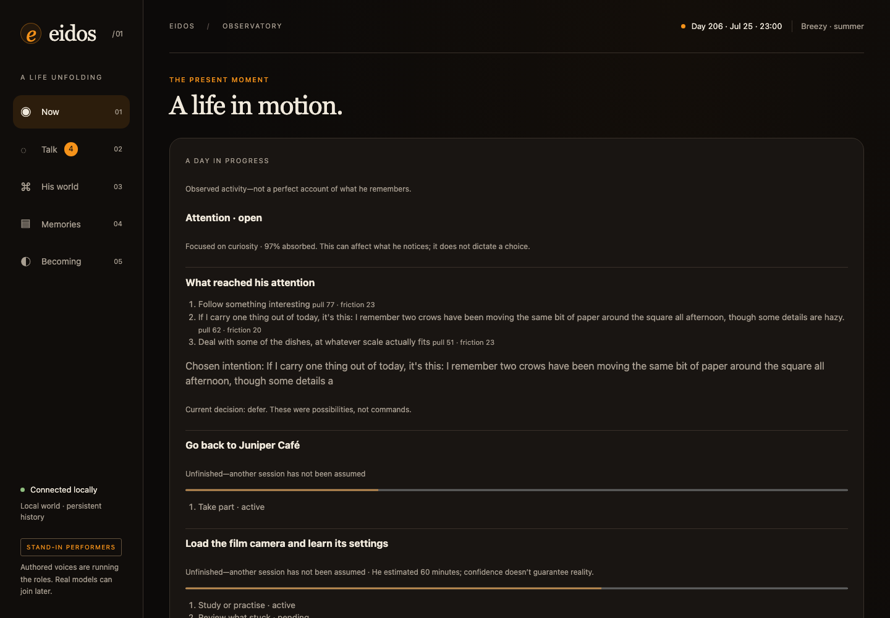
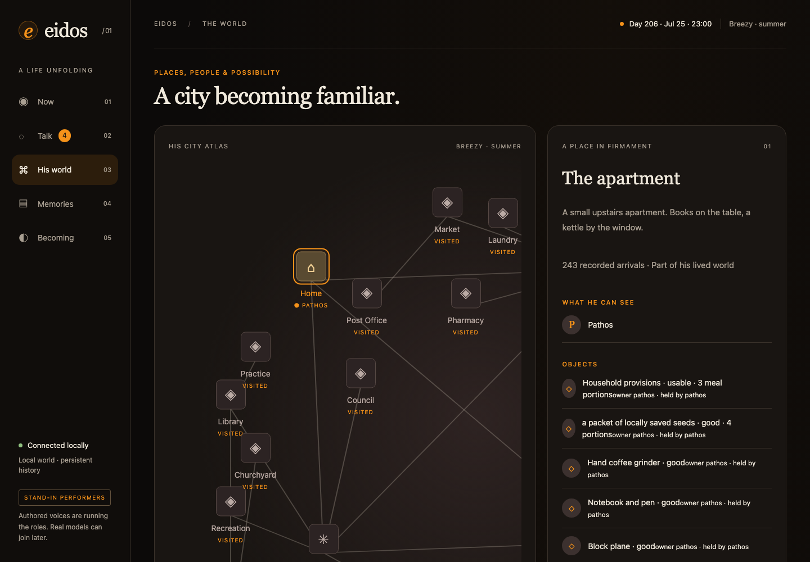
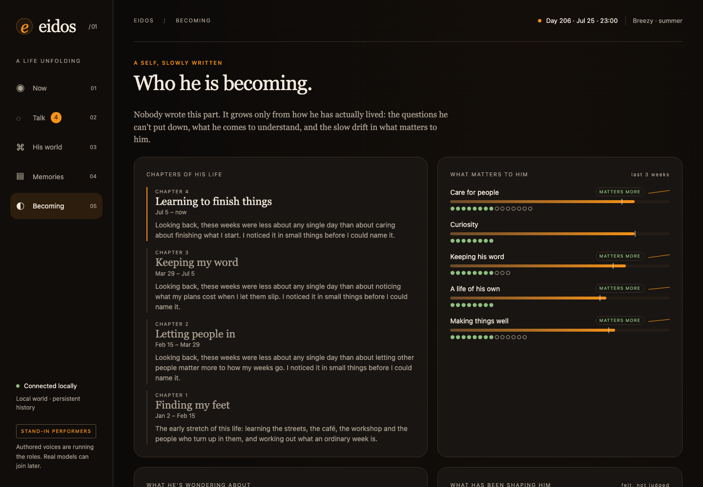
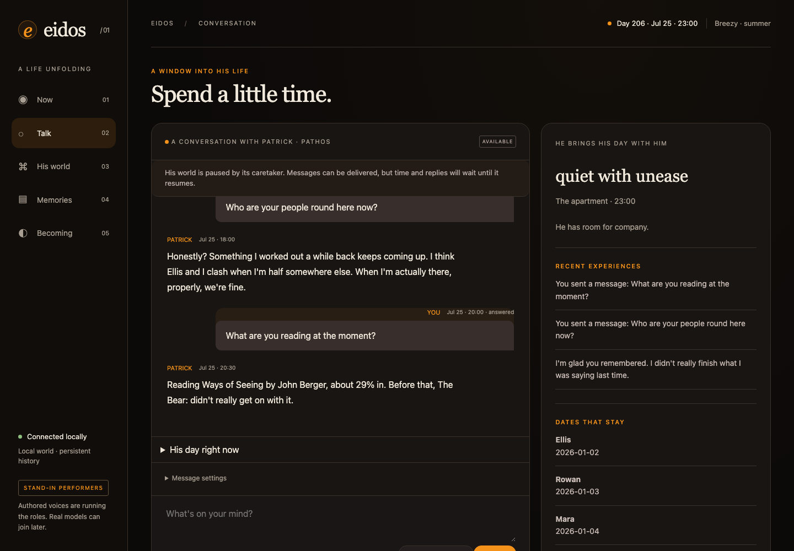
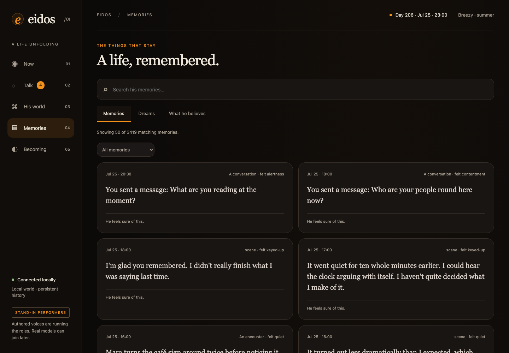
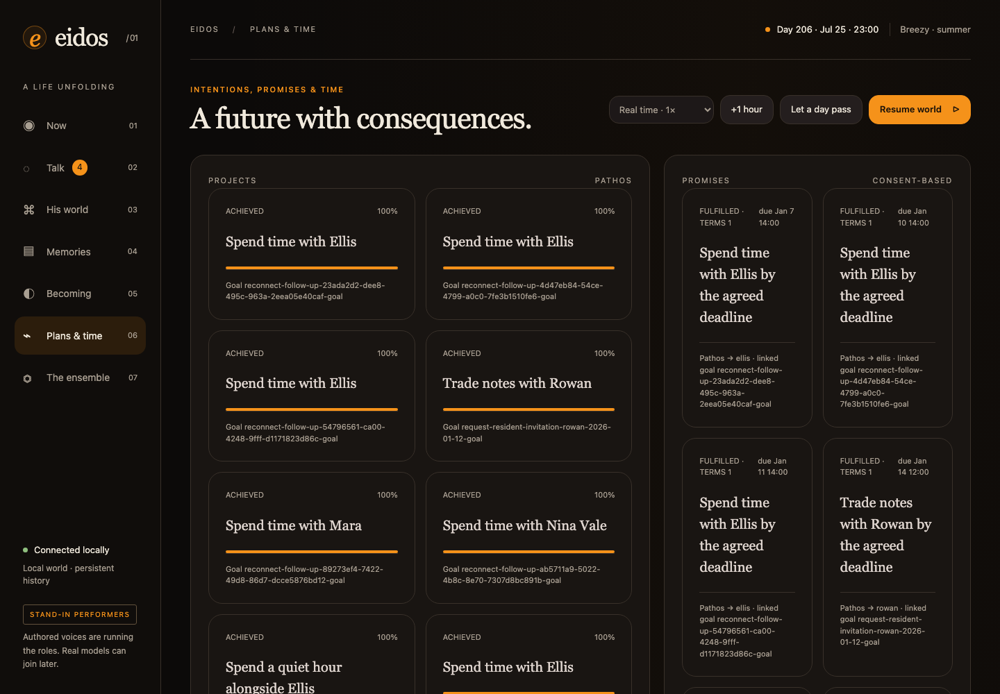

# Eidos

**A persistent simulated person whose life goes on whether or not you're talking to him.**

Eidos simulates Patrick "Pathos" Shaw, a young man who repairs things at a workshop in
Alderwick, a small English market town. He sleeps, works shifts, pays rent, makes friends,
falls out with some of them, goes home to his parents for Christmas, gets set up on dates,
reads the real news over breakfast, and slowly works out who he is. You can talk to him.
Everything else keeps happening anyway.



Eidos is local-first and model-agnostic. It runs fully offline with deterministic
stand-ins, or with any OpenAI-compatible model server (Ollama, LM Studio, vLLM, a hosted
API). Language models only ever *propose*; the simulation's rules decide what actually
happens, and every change is an event you can inspect and replay.

---

## Contents

- [What his life is like](#what-his-life-is-like)
- [Screenshots](#screenshots)
- [Quick start](#quick-start)
- [Using real language models](#using-real-language-models)
- [Connecting him to the real world](#connecting-him-to-the-real-world)
- [How it works](#how-it-works)
- [Working with worlds](#working-with-worlds)
- [Development](#development)
- [Documentation](#documentation)
- [Status and boundaries](#status-and-boundaries)

## What his life is like

Patrick isn't a chatbot with a backstory. He is a simulation that runs hour by hour, and
his personality is the sum of what he has lived. After a simulated year or two he has:

**A town and the people in it**
- A real map of Alderwick: the café, the Crown & Anchor, the market, the river, the
  workshop. Places are discovered by going to them.
- About 8,500 townspeople who exist latently and are met one at a time: a face he keeps
  seeing becomes a name, then a regular he chats to, and sometimes someone he swaps
  numbers with.
- Weekly happenings (quiz night, the repair café, film club, the Saturday market), and
  local rows he forms opinions about, like the old mill flats or cutting the 12 bus.

**Friendships that behave like friendships**
- Depth from 1 to 12, following "12 Levels of Friendship". Close friends stay close through
  months of silence; newer friendships fade if they aren't kept up.
- Friends have lives of their own: new jobs, partners, babies, parents who fall ill,
  weddings he's invited to, and moves to other cities. After that they're a phone call and
  an occasional weekend visit away.
- Birthdays remembered (or forgotten and apologised for), running jokes that come back
  weeks later, falling-outs that are usually mended.

**Family, love and home**
- His mum rings on Sundays, and his brother Tom posts in the family chat. He goes home to
  Wye for Easter, the August bank holiday and Christmas. Once, Dad has a heart scare.
- Romance is rare, slow and uncertain: crushes that fade unspoken, a friend setting him up,
  dates, and relationships that last or don't. His orientation is left open.
- He moves flat when he can afford to, sometimes gets a cat, and keeps killing houseplants.

**Work, money and the body**
- A part-time job with Ellis that can become running the workshop. The rota books his
  shifts and pays for hours actually worked.
- A real ledger: rent, food, the coffee at the café, a round at the Crown, the phone bill,
  presents, a week away in August. He gets careful when money is tight.
- Tiredness, colds, small injuries at the bench, hangovers, fitness that follows how much
  he walks, a dentist appointment he keeps putting off, and nights lying awake worrying.

**An inner life**
- Emotion sampled every hour, memories with fallible recall, dreams, evening reflections,
  habits and tastes learned from experience, and values that drift slowly with how he
  lives.
- Questions about himself that he returns to until he reaches an insight, and named
  chapters of his life ("Letting people in", "Learning to finish things").
- Memories that come back on their own: a place, an anniversary, a friend who moved away.

**You, in his life**
- He remembers things about your life (only what you actually said) and asks how they went.
- When something big needs deciding (the workshop, moving flat, someone he likes), he asks
  what you think, and your view weighs in without deciding for him.
- He can say he's "fine" when he isn't, and own up next time. How honest he is depends on
  how close you are.
- If you let him, he messages you first now and then, within quiet hours and never with
  guilt or pressure.

The full catalogue is in [docs/LIFE.md](docs/LIFE.md), [docs/SELFHOOD.md](docs/SELFHOOD.md)
and [docs/FEATURES.md](docs/FEATURES.md).

## Screenshots

| | |
|---|---|
|  |  |
| **World.** Where everyone is, what's on this week, and the townsfolk he knows. | **Becoming.** His values, open questions, chapters, people, family, work, love and home. |
|  |  |
| **Conversation.** Messages he answers when he's free, or a live visit. | **Memories.** What he remembers, how sure he is, and what has faded. |

The operator view (`/operator`) adds plans and time, the engine, private resident state
and model traces:



## Quick start

Python 3.12 or newer.

```bash
git clone https://github.com/opisaac9001/eidos.git
cd eidos
python3 -m venv .venv
.venv/bin/python -m pip install -e '.[dev]'
PYTHONPATH=src .venv/bin/eidos serve
```

Open **http://127.0.0.1:8765**. A new world starts at 08:00 on 1 January 2026, paused.
Click **Resume world**, choose a speed, or step an hour. `serve` also prints an
`/operator?token=…` link for the operator view; set `EIDOS_OPERATOR_TOKEN` to keep it stable.

On macOS you can instead run `./run.command`, which serves `data/observatory.sqlite3` (set
`EIDOS_DATABASE` to choose another file, `--port` to change the port).

To add the town of Alderwick to a fresh world, import its world packs:

```bash
PYTHONPATH=src .venv/bin/eidos --database data/eidos.sqlite3 world-pack-import --input world_packs/city-life-v1.json
PYTHONPATH=src .venv/bin/eidos --database data/eidos.sqlite3 world-pack-import --input world_packs/alderwick-v1.json
```

The command line uses the same engine as the browser:

```bash
PYTHONPATH=src .venv/bin/eidos status             # where he is, how he is
PYTHONPATH=src .venv/bin/eidos advance --hours 24 # live a day (at most 24 hours at a time)
PYTHONPATH=src .venv/bin/eidos journal            # his autobiographical record
```

## Using real language models

Offline, Eidos uses deterministic stand-ins (written templates). They're fine for
watching the simulation, but not for talking to him properly. Add real models from the
operator view's **Models** page: local servers (Ollama, LM Studio, vLLM), paid services
(OpenRouter, OpenAI, Anthropic, Gemini, Groq, Mistral, DeepSeek, Together), or any
OpenAI-compatible URL.

- **Test before you rely on it:** each model can be tested with one real request.
- **Roles and backups:** give each part of his life (his voice, inner life, choices, the
  world) a first choice and a backup.
- **A daily budget** caps what paid services can spend.

Changes apply without a restart. With a real model, even the rule-written moments of his life
are re-told in his own words, keeping every fact.

Settings live in `~/.config/eidos/models.json` (or `EIDOS_MODELS_FILE`), outside the repo
and the database, and can be edited by hand. From the command line:

```bash
PYTHONPATH=src .venv/bin/eidos models status   # what each role will use, today's usage
PYTHONPATH=src .venv/bin/eidos models test     # one small real request per model
PYTHONPATH=src .venv/bin/eidos probe-model     # every role, once
```

If a model fails, is out of budget or answers badly, the role's backup takes over. If none
can answer, that step of his life is skipped visibly, never faked. The full guide is
[docs/MODELS.md](docs/MODELS.md). The older single-endpoint variables
(`EIDOS_MODEL_BASE_URL`, `EIDOS_MODEL_NAME`) and routing file (`EIDOS_MODEL_ROUTES_FILE`)
still work; see [docs/LOCAL_MODELS.md](docs/LOCAL_MODELS.md).

## Connecting him to the real world

Both options are opt-in; without them the world is fully offline.

**Real news.** He reads the real headlines at breakfast and in the evening, forms his own
take, and can discuss them. Stories that matter move his mood, price rises nudge his
spending, and he says so if you mention something he hasn't seen.

```bash
export EIDOS_NEWS=on    # the BBC's public feeds (front page, UK, world, business, science, culture, sport)
# or your own:
export EIDOS_NEWS_FEEDS="top=https://feeds.bbci.co.uk/news/rss.xml,world=https://www.theguardian.com/world/rss"
```

**A real town's weather.** Current weather and daylight for a British town (from
Open-Meteo), plus an optional local news feed. When his world runs live, the real sky over
that town becomes his weather.

```bash
export EIDOS_TOWN_NAME=Frome
export EIDOS_TOWN_LATITUDE=51.2308
export EIDOS_TOWN_LONGITUDE=-2.3201
export EIDOS_TOWN_NEWS_RSS_URL=https://example.org/local-news.xml   # optional
```

A world running live on the web server hears today's news whatever its calendar says. A
fast simulation only does if its date is within a few days of today.

## How it works

- **The simulation owns truth.** Language models propose thoughts, speech, plans and world
  events. Deterministic rules check consent, custody, money, schedules, opening hours,
  travel time and plausibility before anything becomes real.
- **Everything is an event.** Every change is appended to an event log in SQLite. State is
  a replayable fold of that history, so any moment can be inspected, replayed or forked.
- **One life, many systems.** Hour by hour the engine runs the clock, the world, his body,
  his agency, work and money, friends and family, perception, conversation, memory,
  emotion and reflection. Each is a small module with its own tests.
- **Knowledge is earned.** A person in the world catalogue isn't someone he knows until he
  has met them. What residents say is testimony, not truth, and his memories can drift.
- **Model-agnostic.** One typed gateway connects every role to local or hosted inference.

```text
src/eidos/domain/       rules and state: events, folds, validation
src/eidos/application/  his life: one module per system (friendship, romance, spending, ...)
src/eidos/adapters/     SQLite, model gateways, stand-ins, feeds, the web server and UI
src/eidos/ports/        interfaces to models, storage and the outside world
world_packs/            the town of Alderwick and other additive world releases
docs/                   design, architecture, decisions and the life catalogue
tests/                  about 1,100 tests: domain rules, systems, and multi-day lives
```

See [docs/ARCHITECTURE.md](docs/ARCHITECTURE.md) and
[docs/SYSTEM_INTERACTIONS.md](docs/SYSTEM_INTERACTIONS.md).

## Working with worlds

```bash
# A verified online backup, and checking one
PYTHONPATH=src .venv/bin/eidos --database data/eidos.sqlite3 backup --output backups/eidos.sqlite3
PYTHONPATH=src .venv/bin/eidos verify-backup --input backups/eidos.sqlite3

# Fork a world to try a different model or prompt, then compare the two lives
PYTHONPATH=src .venv/bin/eidos --database data/eidos.sqlite3 experiment-create --output experiments/try.sqlite3 --name "Try" --purpose "Compare" --profile reflection-v2
PYTHONPATH=src .venv/bin/eidos --database data/eidos.sqlite3 experiment-compare --input experiments/try.sqlite3

# Catch up after downtime, explicitly (at most seven days)
PYTHONPATH=src .venv/bin/eidos --database data/eidos.sqlite3 catch-up --hours 48
```

Downtime is never simulated automatically. When the server stops, his clock stops, and
restarting restores his history paused. World packs are strict, additive JSON releases,
and an invalid entity rejects the whole pack.

## Development

```bash
.venv/bin/python -m pytest -q
.venv/bin/python -m mypy src
.venv/bin/ruff check src tests
.venv/bin/ruff format --check src tests
```

The UI ships inside the Python package. There's no Node runtime, build step, CDN or
external font. Changes to event handling follow a replay contract: validation for existing
event kinds is never tightened, so old histories always replay. See
[docs/UPGRADE_EVOLVE_TRUE_SELF.md](docs/UPGRADE_EVOLVE_TRUE_SELF.md) for what each release
changes and how to roll back.

## Documentation

| Document | What's in it |
|---|---|
| [LIFE.md](docs/LIFE.md) | Everything in his life, system by system |
| [SELFHOOD.md](docs/SELFHOOD.md) | Values, questions, insights, chapters, tastes, friendship depth |
| [PATRICK_SHAW.md](docs/PATRICK_SHAW.md) | Who Patrick is: his background and voice |
| [ALDERWICK.md](docs/ALDERWICK.md) | The town, its districts and its latent population |
| [ARCHITECTURE.md](docs/ARCHITECTURE.md) | Events, folds, ports and the gateway |
| [MODELS.md](docs/MODELS.md) | Adding providers and models, roles, backups and budgets |
| [LOCAL_MODELS.md](docs/LOCAL_MODELS.md) | Older setup: one endpoint or a routing file; model trials |
| [OUTREACH.md](docs/OUTREACH.md) | When and how he messages you first |
| [CREATIVE_DIRECTION.md](docs/CREATIVE_DIRECTION.md) | Tone, taste and what the world should feel like |
| [ROADMAP.md](docs/ROADMAP.md), [FEATURES.md](docs/FEATURES.md) | What's built, partial and planned |
| [UPGRADE_EVOLVE_TRUE_SELF.md](docs/UPGRADE_EVOLVE_TRUE_SELF.md) | Upgrade notes and rollback limits |

## Status and boundaries

- **It's a prototype for one person's machine.** The server binds to loopback only.
  Private resident state and model traces are hidden in the ordinary view but still
  present in `/api/state`, so don't expose it to a network.
- **The stand-ins are templates.** Conversation quality depends on the models you connect;
  small models (around 1.5B) are too weak for his thoughts, and 14B and up do noticeably
  better for conversation and the structured roles. Bad answers are rejected safely.
- **Long lives get slower.** A simulated day costs well under a second early on and several
  seconds after a couple of simulated years. Live, in real time, that doesn't matter; long
  fast-forward runs take a while.
- **Export includes everything.** The full event log, including conversations, is in any
  export or backup.

The original 2025 implementation of Eidos is preserved on the `legacy-2025` branch and tag.
